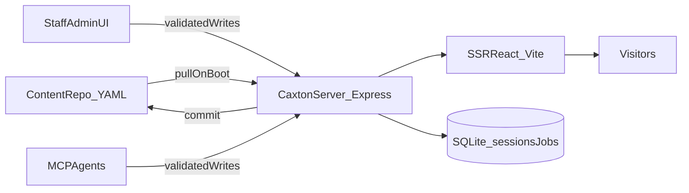

# Caxton

**The agentic CMS — own your website in the AI era.**

Git-backed content. Schema-validated components. One Node process.
Staff edit in the admin UI. Agents edit through MCP. Both land as commits.

[](LICENSE)
[](https://nodejs.org)
[](https://www.typescriptlang.org/)
[](https://vitest.dev)
[](CONTRIBUTING.md)

[Quick start](#quick-start) · [Install](INSTALL.md) · [Architecture](#how-it-works) · [MCP for agents](#agent-native-let-ai-run-your-website) · [Deploy](#deploy) · [Roadmap](#roadmap) · [Contributing](CONTRIBUTING.md)


*Demo GIF coming soon — add `docs/assets/demo.gif` before going public.*

---

## Status: early access

Caxton is under active development. The core CMS is production-tested; some items below are still in progress.

| Area | Status |
|---|---|
| YAML content model, Git sync, component registry | Shipped |
| Visual admin UI, SEO, media gallery, multi-site | Shipped |
| MCP server for AI agents | Shipped |
| VPS / Replit / generic Node deploy | Shipped |
| Clerk authentication (replacing legacy auth) | In progress |
| Full decoupling from upstream branding and APIs | In progress |
| `npx create-caxton` one-command installer | Planned |
| Hosted demo | Planned |

---

## What is Caxton

Caxton is **the agentic CMS** — a self-hosted platform where your website lives in a Git repo you control, and both humans and AI agents edit it through the same schema-validated pipeline.

Your content is **YAML in Git**. Pages compose from **versioned React components** in `shared/component-registry/` and `site_*/component-registry/`. Staff use the visual admin UI. Agents use **MCP**. Everything deploys as one Node process on a $15 VPS — no database server, no platform subscription.

> **Dual write path:** The admin UI and MCP hit the **same validation** and both produce **Git commits**. There is no separate content database behind the editor.

## Why Caxton

In 1477, **William Caxton** printed the first book in English. He owned the press. He chose what to publish and in which language. He did not rent his distribution from someone else.

Caxton is named for that idea: **own the means of publishing**. Your pages live in Git. Your components are yours. Your agents edit the same YAML your team does — validated, committed, reviewable. Yesterday it was a printing shop; today it is a repo and a VPS.

## Why this exists

| The tool | The wall |
|---|---|
| **Wix / Squarespace** | Fine until you need custom logic, real SEO control, or hundreds of programmatic pages. Then you're stuck, and the bill grows per feature. |
| **WordPress** | Plugin roulette, a database server to babysit, and a security surface you did not ask for. |
| **Contentful / Sanity** | Great API, but content lives in someone else's cloud and pricing scales with your success. |
| **Next.js + MDX from scratch** | Total freedom, zero editor. Your marketing team files GitHub issues to fix a typo. |

Caxton is the fifth option: **own the press, own the repo, keep the editor.**

## Who this is for

- **Developers** who want a real CMS without operating a database cluster
- **Vibecoders** who want AI agents to build and edit their site through a typed, validated interface instead of guessing at HTML
- **Agencies** running many client sites — multi-site is built in; one deployment, one content repo per client
- **Marketing teams** who need a visual editor but whose engineers refuse to install WordPress
- **Anyone tired of $30/mo turning into $200/mo**

## Quick start

**Requirements:** Node 20+ and npm 10+. That's the whole list.

```bash
git clone https://github.com/YOUR_ORG/caxton
cd caxton
npm install
cp sites.yml.example sites.yml   # point a domain at a content folder
npm run dev
```

Open **http://localhost:5000**. You have a running site.

To edit content, open the admin bubble, pick a page, and change a section. Your edit is written to YAML and committed to your content repo when GitHub sync is enabled.

Full setup, every environment variable, and production notes: **[INSTALL.md](INSTALL.md)**

## The cost argument

Caxton runs the entire stack in **one Node process**. No Postgres, no Redis, no container orchestration. Persistence is embedded SQLite on disk ([`server/db.ts`](server/db.ts)); public content is flat YAML.

| | Caxton | Wix Business | WordPress (managed) | Contentful |
|---|---|---|---|---|
| **Monthly cost** | ~$15 VPS | $36+ | $25–100+ | $300+ at scale |
| **Pages** | Unlimited | Tier-limited | Unlimited | Entry-limited |
| **Own the code** | Yes | No | Partly | No |
| **Content in Git** | Yes | No | No | No |
| **Custom components** | Yes, first-class | No | Plugin-dependent | Bring your own frontend |
| **AI agent editing** | Native (MCP) | No | No | API only |
| **Migrate away** | It's your repo | Painful | Possible | Export and rebuild |

You are trading a subscription for a droplet and a `git push`.

## How it works



Three ideas do the heavy lifting:

**1. Content is YAML in Git.** A page is a `meta` block plus an array of `sections`. Every write is validated, committed, and reviewable as a diff. Rollback is `git revert`. Content lives under `site_*/` (see [`sites.yml`](sites.yml.example)).

**2. Pages compose from a component registry.** Each component ships a Zod schema, example content, field editors, and a screenshot under `shared/component-registry/` or `site_*/component-registry/`. The schema drives the admin UI, validation, and AI tooling — you define it once.

**3. Editing is schema-gated, for humans and machines.** The admin UI and MCP server hit the same validation. An agent cannot write a section that a human could not have written.

```yaml
# site_example-com/pages/home/en.yml
meta:
  title: Learn to build with AI
  description: Hands-on programs for developers.
sections:
  - type: hero
    variant: single_column_image_full
    data:
      heading: Build things that matter
      cta: { label: Start free, url: /signup }
  - type: faq
    variant: default
    data:
      items:
        - { question: Is it free?, answer: The first module is. }
```

## Features

| Area | What you get |
|---|---|
| **Content** | YAML entries, locales, drafts, variants, shared layouts, section binding |
| **Components** | Versioned registry, Zod schemas, live examples, generated field editors |
| **Editing** | Visual admin UI, inline section editing, media picker, diff preview |
| **SEO** | Sitemaps, hreflang, canonical URLs, schema.org, redirect manager with conflict detection |
| **Media** | Local or GCS storage, WebP/AVIF, `srcset`, auto-tagging, usage tracking — see [docs/media-storage.md](docs/media-storage.md) |
| **i18n** | Per-locale files, fallbacks, translated slugs, IP-based locale routing |
| **Search** | Vector search via Qdrant with local embeddings |
| **Forms** | Lead capture with Cloudflare Turnstile |
| **AI** | Content adaptation, translation, brand-voice context, any OpenRouter-compatible model |
| **Agents** | Full MCP server with capability-scoped tools |
| **Analytics** | GTM and server-side GTM support |
| **Ops** | Content validation, diagnostics jobs, atomic deploys |
| **Multi-site** | One deployment, many domains, one content repo each — [docs/multi-site.md](docs/multi-site.md) |

## Agent-native: let AI run your website

Caxton ships an **MCP server** so Claude, Cursor, or any MCP client can operate your site as a first-class user:

```bash
npm run mcp
```

Agents get typed tools — `list_entries`, `update_fields`, `add_section`, `translate_entry`, `run_entry_diagnostics`, `test_redirect` — with capability-scoped permissions. Every mutating tool returns structured **`warnings`**, **`side_effects`**, and **`next_actions`**, so the agent knows what it did *not* do (locale fan-out, binding propagation) and what to call next.

> "Translate the pricing page to Spanish, then check for redirect conflicts."

That's one prompt, and the result lands as a reviewable commit in your content repo.

Full tool reference: **[mcp-server/README.md](mcp-server/README.md)**

## Authentication

Auth is **pluggable**. The target default is **[Clerk](https://clerk.com)** for staff sign-in and MCP OAuth — you bring your own Clerk project; Caxton does not tie you to any specific identity provider.

| | |
|---|---|
| **Status** | In progress (legacy auth still present in some routes) |
| **Self-hosters** | Configure your provider via env; no vendor lock-in |
| **MCP** | Capability grants map to signed-in staff roles |

## Deploy

Anywhere Node 20 runs. No Docker required, no managed database to provision.

```bash
NODE_ENV=production npm run build
NODE_ENV=production npm start
```

| Target | Notes |
|---|---|
| **VPS** | Reference deployment — [docs/vps.md](docs/vps.md) |
| **Replit** | Works out of the box; Replit Vite plugins load only when `REPL_ID` is set ([`vite.config.ts`](vite.config.ts)) |
| **Docker** | Bring your own image; same `build` + `start` |
| **Any Node host** | Railway, Fly.io, a laptop — one process, one port |

## Docs by goal

| I want to… | Read |
|---|---|
| Get it running locally | [INSTALL.md](INSTALL.md) |
| Understand multi-site setup | [docs/multi-site.md](docs/multi-site.md) |
| Deploy to a VPS | [docs/vps.md](docs/vps.md) |
| Put media in Google Cloud Storage | [docs/media-storage.md](docs/media-storage.md) |
| Put the site behind a CDN | [docs/cloudflare-cdn-setup.md](docs/cloudflare-cdn-setup.md) |
| Wire up analytics | [docs/gtm-analytics-setup.md](docs/gtm-analytics-setup.md) |
| Add a new section component | [shared/component-registry/README.md](shared/component-registry/README.md) |
| Connect an AI agent | [mcp-server/README.md](mcp-server/README.md) |
| Run on Replit | [replit.md](replit.md) |

## Roadmap

- [x] YAML content model with Git sync
- [x] Component registry with schema-driven editors
- [x] MCP server with capability grants
- [x] Multi-site from a single deployment
- [ ] Clerk authentication
- [ ] Full decoupling from legacy upstream integrations
- [ ] One-command installer (`npx create-caxton`)
- [ ] Starter templates (blog, docs, SaaS landing, portfolio)
- [ ] Drag-and-drop section reordering in the visual editor
- [ ] Plugin API for third-party components
- [ ] Hosted demo you can click through

## FAQ

**Do I need a database?**
No database server. Public content is YAML on disk. Sessions and background jobs use embedded SQLite, created automatically on first boot.

**Can non-technical people use it?**
Yes — that's the point of the admin UI. Publishing writes YAML and commits it for them when Git sync is enabled.

**How do I add my own component?**
Create a folder in the component registry with a `schema.ts`, an example YAML, and a React component. The editor UI is generated from your schema. See [shared/component-registry/README.md](shared/component-registry/README.md).

**Is this production-ready?**
The core CMS has been exercised on real traffic. The public API surface is still moving — pin your version and read the changelog before upgrading.

**Why "Caxton"?**
Named for William Caxton, who brought the printing press to England and published the first book in English — he owned the press. Caxton is the agentic CMS for people who want to own theirs. Not to be confused with [Pootlepress Caxton](https://github.com/pootlepress/caxton), a WordPress Gutenberg block plugin.

## Contributing

Issues and PRs welcome. Good first contributions: new components, starter templates, docs, storage providers (S3, R2, Azure).

```bash
npm install
npm test        # vitest
npm run check   # TypeScript
```

See **[CONTRIBUTING.md](CONTRIBUTING.md)**.

## License

MIT — see [LICENSE](LICENSE).
