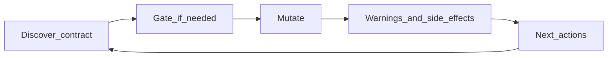

# MCP Has No Quality Standards. We Wrote Ours So Agents Can Run Our Website.

Our website content is now something agents can manage end-to-end through an MCP server: discover a content type, sample peers, create or edit entries, patch sections and SEO, translate, run diagnostics. That sentence sounds like a product demo. It is not. It is the outcome of treating **agent-facing quality** as a product problem.

The Model Context Protocol gives you transport, auth shapes, and a way to expose tools. It does not tell you how to teach an agent what a write did *not* do, how wide the blast radius is, or which registered tool to call next. Dump thirty tools with long descriptions into a server and you have not built a CMS for agents — you have built a footgun with JSON-RPC.

We had to invent a quality bar. This essay is that bar: the standards we use so agents can run content workflows on a YAML-driven marketing site without inventing schema, silently fan-outing locales, or pasting a page shell into a blog entry.

To be precise about the claim: agents can manage **website content** through this MCP — entries, sections, meta/SEO, shared-layout shells, translations, diagnostics — not “the whole company runs on agents.” The interesting part is how little improvisation the successful sessions require once the server steers them.

## The gap the protocol leaves open

MCP is excellent at the wiring. An agent lists tools, calls one, gets text (or structured content) back. Clients already know how to negotiate transports and present tool UIs. What happens *inside* those tool payloads is entirely up to the server author. That is where quality lives — and where the ecosystem is silent.

There is no shared convention for:

- Declaring that a successful write **did not** update sibling locales
- Naming the **next** registered tool with copy-pasteable arguments
- Separating “this is wrong” from “this needs a human (or orchestrator) to confirm”
- Shipping a playbook for dangerous content shapes before the first mutate

So every team invents something. Or, more often, invents nothing: a thin wrapper over an internal API, a wall of markdown in the tool description, and hope.

Naïve MCP servers tend to fail in the same ways:

- **Essays instead of contracts.** Success is a paragraph. The agent skims it, misses the clause about variants, and “fixes” something that was never broken. Tokens spent on tone; facts lost to skim.
- **Silent side effects.** A write updates three locales or twenty bound sections and never says so — or worse, the opposite: the agent *assumes* fan-out happened when it did not, then ships a half-translated shell.
- **Invented follow-ups.** The model hallucinates a `validate_content` tool because the prose said “you should validate.” That tool does not exist. The session derails into apologies and retries.
- **Token-heavy reads.** Unfiltered list endpoints dump the world. Context fills with SEO blobs the agent did not ask for. Later reasoning degrades for unrelated reasons.
- **Hard errors for soft judgment.** Multi-site ambiguity or “are you sure this is live?” becomes a 400. The agent retries randomly — maybe flips a boolean, maybe changes the slug — instead of confirming with a principal.

None of that is fixed by adding more tools. More tools without a response contract multiply the ways an agent can be confidently wrong. Quality is deciding what every mutating response **owes** the agent — and what the server will **refuse** to do on the agent’s behalf.

## A mental model of our content MCP (just enough)

We run a content-driven marketing site. Public pages are authored in YAML and rendered by section components. The vocabulary agents need is small:

- **Content types** — defined centrally; each has a directory, URL pattern, field mapping, editor rules. Some are DB-backed (`create_via` null for YAML create tools). Some are static YAML.
- **Entries** — one slug under a content type (`blog`, `program`, `page`, …). The content-type key `page` is unrelated to tool names like `list_entries`.
- **Locales** — `en.yml` / `es.yml` plus `_common.yml` merged at read time.
- **Sections** — ordered list of typed blocks on ordinary pages. Agents edit them with section tools; SEO/meta goes through meta tools. Mixing those paths is a common agent mistake we reject in the server.

Some types are ordinary “page of sections.” Others are **shared-layout**: a shell lives in `template.{locale}.yml` (hero, article wrapper, breadcrumb, CTA, FAQ; legacy `single.*` still loads if present), and each attached entry only carries fields like `title`, `description`, `content`, `category`, with `sections: []`. Blog is the textbook case — YAML plus `single_template`, creatable via MCP, and **not** the same thing as DB-backed types. Confusing those two is how agents skip `create_entry` or invent a draft workflow that does not exist for that type.

Multi-site means: call `list_sites` when more than one domain exists, then pass `site` on every later call. Ambiguous site is a gate, not a coin flip.

That is enough architecture to understand the standards. The rest of this essay is not a tool catalog. It is how we *talk* to agents through those tools.

## The standards we wrote

Think of the agent loop as a product surface:



Discover the contract. Gate when judgment is required. Mutate. Educate with structured non-effects and blast radius. Hand back the next real tool call. Repeat. If any step of that loop is “read a paragraph and guess,” you do not have a standard — you have a blog post inside a tool response.

### 1. A structured envelope on every mutate

Mutating tools do not return ad-hoc success blobs. They go through shared helpers that always serialize:

- `warnings` — what did **not** / will not happen (always an array, even if empty)
- `next_actions` — exact registered tool names to call next, with `priority` (`required` | `recommended` | `optional`) and optional `args_hint` (always an array)
- `side_effects` — optional blast radius beyond the obvious write (`bound_updates`, shared-template impact, and similar)

There are three shapes: `ok` (success), `fail` (hard error, no pretend next step), and `actionRequired` (a non-error gate — confirm live edit, pick layout target, supply `site`, confirm a new URL-param value). Inspection-only reads that merely report state return empty `next_actions` unless a follow-up is required for correctness.

One illustrative success payload looks like this:

```json
{
  "success": true,
  "message": "Updated sections.0.title",
  "warnings": [
    {
      "code": "variant_no_binding_propagate",
      "message": "Edits to this variant do not propagate to section-binding siblings."
    }
  ],
  "next_actions": [
    {
      "tool": "get_entry_content",
      "priority": "optional",
      "reason": "Verify the live merge for this locale",
      "args_hint": { "slug": "home", "locale": "en" }
    }
  ]
}
```

After that, we paraphrase. The point is not the JSON — it is that **non-effects and next calls are data**, not buried clauses in a paragraph. Empty arrays are honest. Missing keys teach agents to ignore the contract.

We enforce this in code review too: mutating handlers must use the helpers; `next_actions[].tool` must be a real registered name; no inventing `validate_content`.

### 2. Dense facts over essays (staff vs agents)

Humans in an admin UI need always-visible how-it-works copy, empty states that teach, and optional “read more” with concrete relative file paths. Dual write paths deserve banners. Staff education prefers clarity over brevity.

Agents need the opposite compression: short tool descriptions plus structured fields that do not drop facts to save tokens. A staff paragraph about “this edit does not update sibling locales or binding groups; bindings only sync on live non-variant updates” becomes three MCP fields: a warning code, a side-effect summary, and a `next_actions` entry with the real tool name and `args_hint`.

The rule we use internally is blunt: prefer dense structured education over long prose — **with no loss of facts** (precedence, locale scope, which file, what does not happen). If you shortened the payload by deleting a non-effect, you did not make it efficient. You made it lying-by-omission.

### 3. Guide, don’t fan out

We deliberately do **not** auto-fan-out sibling `template.*.yml` files from MCP writes. Locale sync for shared templates is agent-driven via `next_actions`. Soft prose alone is not enough; the follow-up must name a real tool and carry blast-radius reason text (“shared template,” sibling structure rules, what breaks if you skip it).

Why refuse fan-out? Surprise multi-file writes are worse than an extra round trip. Agents (and humans reviewing transcripts) need to see each locale intentionally updated. Silent sync also fights the mental model that MCP loopback skips the main app’s shared-layout fan-out path — the agent is the orchestrator.

Same tool set for shared layout and entry overlays. We use `layout_target` (`auto` | `entry` | `type_single`) and `confirm_layout_target` when ambiguous. We never invent parallel `*_shared` tools. One vocabulary scales; two vocabularies double the hallucination surface. “Should I call `update_fields` or `update_fields_shared`?” is a question that should not exist.

### 4. Gates over opaque errors when judgment is required

If the agent might be about to edit live content, hit the wrong layout target, omit `site` on a multi-site deploy, or invent a new `:category` value, we return `actionRequired` — not a cryptic failure. The payload explains what to confirm and often includes `next_actions` for the retry with the flag set (`confirm_live_edit`, `confirm_new_values`, and so on).

Gates turn “the model guessed wrong” into “the model asked the principal.” The principal might be a human in the chat, or an orchestrator/reviewer policy. Either way, taxonomy invention and live-shell edits stop being improvisations.

That is how you give agents write access to production YAML without pretending the model is omniscient. Permission to write is not the same as permission to decide product taxonomy.

### 5. Discover → sample → mutate → verify

The official playbook for shared-layout creates is not “call `create_entry` and hope”:

1. `list_sites` when multi-site — pick a domain and pass `site` everywhere after.
2. `get_content_type_info` — `field_mapping`, `editor.required`, URL params, observed values, `create_via`, whether this is `single_template` or DB-backed.
3. `explain_site` on the recommended topic (for blog: `shared-layout`) when the contract says the write goes live immediately.
4. Sample peers with `list_entries` so category slugs and markdown shape match reality.
5. `create_entry` with exactly one locale for shared-layout, required fields on the locale object, `sections: []` (or omit), URL params / category on `common` as the type expects.
6. SEO via `update_fields / update_meta_fields` if needed; verify with `get_entry_content` / `get_entry_seo`; `run_entry_diagnostics` when ready.

If a URL-param or select value is not in observed peers, stop. Get approval from the principal. Re-call with `confirm_new_values: true`. Inventing taxonomy is a product decision, not an agent flourish.

Anti-patterns we call out in the playbook itself: treating `single_template` as DB-backed and skipping create; authoring breadcrumb/hero/article shells on the entry; calling unfiltered SEO lists expecting a full dump; inventing `:category` values without approval.

### 6. Non-effects are first-class

Agents waste cycles “fixing” things that never happen. So we say so in `warnings` with stable codes:

- Variant edits do not propagate section bindings (`variant_no_binding_propagate`).
- Variant structural edits do not sync sibling locale singles (`variant_no_shared_layout_sync`).
- Promote is locale/entry only and does not replay bindings (`promote_locale_only`, `promote_no_binding_replay`).
- `update_fields` propagates bindings when exactly one section index is touched; multi-section updates are rejected.
- Shared-layout promote does not reconcile sibling locale singles for you (`promote_shared_layout_drift`).

Live single-section field edits **do** propagate section bindings on the server; that belongs in `side_effects` when it happens, not as a vague “also synced stuff.” Clarity about what *did* happen is the twin of clarity about what did not.

If a non-effect only lives in `message` prose, it will be missed under skim pressure. Put it in `warnings`.

### 7. Exact property paths and real tool names only

When ecommerce or CTA validation fails, agent-facing payloads include exact section property paths — for example `sections[2].data.ecommerce_products`, `programs[].id`, `signup_card.cta_button.tracking`, or funnel steps in `_ecommerce.yml` — not only prose like “missing product scope.” Paths live in `message` / `details` / `warnings` / `property_path`. Agents are good at editing a path they can see and bad at reverse-engineering one from a metaphor.

`next_actions[].tool` must be a **registered** MCP tool name. Never invent `validate_content`. Never invent a sibling tool that “sounds right.” If the agent needs a follow-up, point at something that exists, with `args_hint` when you know the args. Recommended playbooks (`explain_site`, `get_content_type_info`) show up here as `priority: "recommended"` so the agent can justify the extra read before a live write.

### 8. Read hygiene

Unfiltered `list_entry_seo` returns a **minimal sample**. Pass `slugs` when you need full meta. Default dumps punish every agent in the session, including the ones that only needed a title check.

The same spirit applies elsewhere: prefer content-type filters and search on `list_entries`; split `get_entry_content` (merged body/sections without forcing SEO) from `get_entry_seo` (meta + schema.org preview). Efficiency is not only about writes — it is about not filling the context window with noise that will never affect the next decision.

## Proof: an agent creating a live blog post

Here is a scrubbed composite of a real session. The agent needed to publish into the live CMS for a shared-layout blog type — no draft safety net. The article belonged to an existing series, so taxonomy already existed; the risk was structural, not naming.

It did not start with `create_entry`.

First it loaded the relevant tools (deferred tools required an explicit search step in that client). Then it proposed — and ran — `get_content_type_info` for `blog` with the site domain. The contract came back clear: shared-layout / `single_template`, live create in one locale, `sections` must be empty, URL pattern with `:category`, required fields `title`, `description`, `content`. Observed category values already included the series slug the article belonged to. Optional fields were listed separately so the agent would not invent requirements.

The response recommended `explain_site` with topic `shared-layout` (`priority: "recommended"`). The agent treated that as blocking for its own confidence: shared-layout means publish-live-immediately, so reading the playbook was cheaper than a bad create. The playbook repeated the mental model: shell in `template.{locale}.yml`; entry fields only on the slug; do not paste hero/breadcrumb/article into the entry; use observed peers for category; verify afterward.

Then it sampled peers with `list_entries` (content type `blog`, search on the series) to confirm the category slug in the wild and to see how published markdown looked — headings, spacing, how images are referenced — before drafting the new body.

Only after that chain was `create_entry` the obvious next call — with `sections: []`, required locale fields filled, and an existing category so `confirm_new_values` was unnecessary. The agent could explain, in its own words, why each prior step existed. That explanation matched our envelope and playbook, which is the point: **the standards were doing the teaching**, not a human pasting CMS lore into the chat.

That is what “agents can manage our website content” looks like in practice: not a model that memorized our CMS, but a server that steers discovery, education, sampling, and gates so the write is boring.

## What we deliberately refused

Standards are as much about refusals as features.

- **No parallel `*_shared` tool families.** One set of tools plus `layout_target` beats a second vocabulary for “the same write but on the shell.”
- **No MCP locale auto-fan-out.** Sibling `template.*.yml` updates are explicit agent steps via `next_actions`. Surprising multi-file writes are worse than an extra round trip.
- **No inventing URL-param values without a principal.** New categories are product decisions; `confirm_new_values` exists for a reason.
- **No success payloads that omit `warnings` / `next_actions`.** Empty arrays are honest. Missing keys teach agents to ignore the contract.
- **No burying blast radius only in prose.** Paths and non-effects belong in structured fields.
- **No pretending DB-backed and `single_template` are the same.** `get_content_type_info` exists so agents stop guessing `create_via`.

Each refusal removes a class of confident mistakes. Feature lists grow; refusal lists keep agents safe.

## A checklist you can steal

If you are building an MCP that mutates anything that matters — content, config, money, permissions — start here:

1. Define a success envelope: always `warnings` and `next_actions` (arrays), optional `side_effects`.
2. Separate hard `fail` from soft `actionRequired` gates for confirmation and ambiguity.
3. Put non-effects in `warnings` with stable codes — not only in paragraphs.
4. Only name **real** tools in `next_actions`; add `args_hint` when you can; use priorities deliberately.
5. Prefer guiding the agent over silently fan-outing side effects.
6. Ship playbooks (`explain_*` topics or equivalent) for dangerous shapes — shared templates, live publishes, multi-tenant `site`.
7. Make discover-before-write the happy path: contract → education → sample peers → mutate → verify.
8. Include exact property paths in validation failures.
9. Keep default reads small; require filters or slugs for full dumps.
10. Write staff UI education for humans and dense structured education for agents — same facts, different compression.

You do not need our content model to adopt this list. You need something expensive enough to regret — then design the envelope before you design the twentieth tool.

## Close

MCP will not save you from a bad agent UX. The protocol does not define quality for blast radius, non-effects, or the next correct call. That vacuum is easy to ignore when your demo is a single read tool. It becomes existential when agents can publish live shared-layout entries into production YAML.

We wrote those standards ourselves — dense contracts, honest warnings, gates for judgment, playbooks for dangerous shapes, and `next_actions` that point at real tools — so agents can manage our website content without treating production like a scratch pad.

Tool count is vanity. Whether the next call is obvious, and whether the agent knows what did **not** happen — that is the quality bar.
