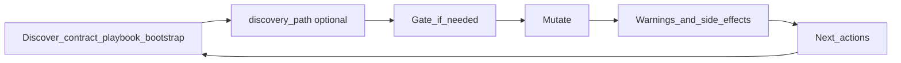

# MCP Server Standards

This is the quality bar we use when we build or change an MCP server. It is written for **humans** — engineers, reviewers, and anyone who needs to understand *why* tools should behave a certain way.

The Model Context Protocol defines how agents connect and call tools. It does **not** define how those tools should teach blast radius, non-effects, or the next correct call. That gap is ours to fill.

Use this document when you add a tool, change a mutate response, or review an MCP PR. The principles apply to any domain (content, commerce, ops, data) — not to one product or site. For the narrative case study behind these ideas, see [MCP Has No Quality Standards…](./mcp-has-no-quality-standards-we-wrote-ours-so-agents-can-run-our-website.md). For code-enforced rules, see `.cursor/rules/mcp-server-responses.mdc`.

---

## What we optimize for

An MCP that **mutates anything that matters** should optimize for:

1. **Correct writes** — agents do the safe thing without memorizing your internal model.
2. **Honest blast radius** — agents know what happened *and* what did not.
3. **An obvious next call** — follow-ups name real tools, not invented ones.
4. **Token efficiency without losing facts** — dense structure beats long essays.

We do **not** optimize for tool count, README-length tool descriptions, or silent "helpfulness" (for example, updating every related resource behind the agent's back without saying so).

---

## The agent loop (mental model)

Every serious mutate should feel like this:

| Step | Meaning |
|------|---------|
| Discover | Read the contract (schema, playbook, sample peers, bootstrap) before inventing shape or side effects. Optionally deepen judgment via `discovery_path`. |
| Gate | If judgment is needed (destructive/live action, ambiguous target, new enum value, missing tenant), stop and ask — do not hard-fail cryptically. |
| Mutate | Perform the write. |
| Educate | Return structured `warnings` / `side_effects` (paths, non-effects, blast radius). |
| Next | Return `next_actions` with **real** tool names and `args_hint` when you can. |

If any step is "read a paragraph and guess," the design is unfinished.

---

## Standard 1 — Response envelope

Mutating tools share one success/error contract. Do not invent one-off success JSON shapes per tool.

| Shape | When |
|-------|------|
| Success (`ok`) | Write succeeded. Always include `warnings` and `next_actions` (arrays; use `[]` when empty). Optional `side_effects`. |
| Hard error (`fail`) | Something is wrong and retrying the same call will not help without changing inputs. Be clear. Do not pretend there is a safe next tool call. |
| Soft gate (`actionRequired`) | Judgment needed: confirm a destructive/live action, disambiguate a target, supply a tenant/site id, confirm a new enum/taxonomy value, etc. May include `next_actions` for the retry. |

**Always say what did not happen.** Non-effects belong in `warnings` with stable `code`s — not only in a friendly `message` paragraph. Agents skim prose; they trust structured fields.

**Inspection/read tools** that only report state should return `next_actions: []` unless a follow-up is required for correctness.

Implement the envelope in one shared helper module so every mutate tool stays consistent.

---

## Standard 2 — Dense education for agents

Human UI and MCP should teach the **same facts** at different compression:

- **Humans (UI / docs):** Clear, explanatory how-it-works; optional advanced detail; empty states that teach.
- **Agents (MCP):** Short tool descriptions + structured `warnings` / `side_effects` / `next_actions`. Keep payloads efficient **without dropping facts** (which resource, which scope, precedence, non-effects).

A human paragraph often becomes three MCP fields. That is intentional. Shortening a payload by deleting a non-effect is not efficiency — it is lying by omission.

---

## Standard 3 — Guide, don't silently fan out

- Do **not** silently update sibling resources (other locales, environments, bound copies, related records) unless the tool's contract makes that blast radius explicit *and* the agent can see it in `side_effects` / `warnings`. Prefer guiding the agent with `next_actions` for follow-up writes.
- Prefer **one** tool vocabulary plus a target/scope parameter over parallel tool families (`update_x` vs `update_x_shared`, etc.). Extra names double the hallucination surface.
- When a write has wide blast radius, say so in `reason` / `side_effects` / `warnings` — what else is affected, what still needs a follow-up, what breaks if they skip it.

Surprising multi-resource writes are worse than an extra round trip.

---

## Standard 4 — Gates over opaque errors

Use a soft gate (`actionRequired`) when the agent needs judgment, for example:

- Confirming a **destructive** or **live/production** action
- Choosing among **ambiguous targets** (which resource, which overlay, which environment)
- Supplying a **tenant / project / site** when more than one exists
- Confirming a **new** enum, tag, category, or other taxonomy value that peers do not already use

Gates turn "the model guessed" into "the model asked the principal" (human or orchestrator). Permission to write is not permission to invent product taxonomy or expand blast radius unnoticed.

---

## Standard 5 — Discover before mutate

Dangerous or structural workflows ship with a **playbook** the agent can fetch (explain/topic tools, schema tools, or equivalent) — not only a long tool description. Session bootstrap (playbook + conversation conventions + recent changelog) teaches standing habits before the first write.

A solid happy path looks like:

1. Discover tenancy / scope when multiple exist → pass that scope on later calls
2. Read the **contract** — required fields, allowed shapes, how create/update works, observed peer values
3. Read the **playbook** when the write is live, shared, or high blast radius
4. **Sample peers** so new data matches real conventions
5. **Mutate**
6. **Verify** with a read or diagnostics tool

Do not make the agent guess which create path applies (draft vs live, shared template vs instance, API-backed vs file-backed). Put that in the contract.

### Optional `discovery_path` (extension of Discover)

Any MCP response may include **`discovery_path`** when the server wants to recommend optional ways to deepen context **before** a consequential next step (decide, mutate, triage, publish, etc.). It is **moment-agnostic** — not tied to one product surface.

| Field | Role |
|-------|------|
| `discovery_path` | Optional research menu (think and/or tools); skip is allowed; does **not** unlock or block the next action |
| `next_actions` | Real follow-ups needed for correctness |

Shape (shared type in `respond.ts`):

- `goal` — deepen context before acting; not `next_actions`; skip does not block
- `items[]` — ordered; **`kind: "think"`** first (judgment / host-agnostic research; no fake MCP tools), then **`kind: "tool"`** (registered catalog name + `available` + optional hint when capped)
- `non_effects` — e.g. skip does not block apply

Rules:

- Not required on every `ok()`
- Think items capped (≤5), short `why` / `look_for`
- Tool names must be real catalog tools; never invent tools
- Unavailable-but-useful tools stay visible (`available: false` + ask-human / refresh-connector hint)
- Do **not** fold discovery items into `next_actions`
- No resource-specific `args_hint` on discovery tool items — the agent chooses args from the rest of the payload

---

## Standard 6 — Exact paths and real tool names

- Validation failures should include **exact property or resource paths** when known — not only metaphors ("missing scope," "invalid config"). Agents edit what they can see.
- When a filesystem or config path matters, put the concrete path in `warnings` / `side_effects`.
- `next_actions[].tool` must be a **registered** MCP tool. Never invent tools that "sound right." Prefer `args_hint` so the next call is copy-pasteable.
- Use priorities deliberately (for example `required` | `recommended` | `optional`).

---

## Standard 7 — Read hygiene

Default reads stay small. Unfiltered "list everything" endpoints should return a **minimal sample** or require filters; full dumps need explicit ids/slugs/queries.

Prefer:

- Filters and search on list tools
- Splitting "heavy" views (full documents, previews, analytics) from "light" views (ids, titles, status)
- Not filling the context window with data that cannot change the next decision

Efficiency is not only about writes.

---

## What we refuse (on purpose)

| Refusal | Why |
|---------|-----|
| Parallel tool families for the same write with different targets | One vocabulary + a target/scope parameter. |
| Silent fan-out across siblings / locales / environments | Agent orchestrates follow-ups via `next_actions`. |
| Inventing new taxonomy values without confirmation | Taxonomy is a product decision. |
| Success payloads missing `warnings` / `next_actions` | Empty arrays are honest; missing keys break the contract. |
| Non-effects only in prose | They get skimmed away. |
| Tool-count vanity | Quality is "next call obvious + non-effects clear." |
| Treating `discovery_path` as required next steps or a gate | Optional judgment; skip must remain allowed. |

---

## Checklist before you ship a mutate tool

Classic bar first:

- [ ] Returns through the shared success / hard-error / soft-gate envelope
- [ ] Always includes `warnings` and `next_actions` (arrays)
- [ ] Documents side effects and non-effects (stable codes + paths when known)
- [ ] `next_actions` only name real registered tools; `args_hint` where possible
- [ ] No silent multi-resource fan-out; wide blast radius is explicit
- [ ] Soft gates for destructive/live / ambiguous target / missing tenant / new taxonomy — not cryptic failures
- [ ] Playbook, explain, or bootstrap considered when the shape is dangerous
- [ ] Validation errors include exact property paths when known
- [ ] Default reads stay small
- [ ] Agent education is dense; same facts as human docs/UI, not a shorter lie
- [ ] Changelog / conventions version bumped if the agent-facing contract changed

Then discovery (when relevant):

- [ ] Should this response attach `discovery_path`? (consequential next step needing judgment)
- [ ] Think items capped and host-agnostic; no fake MCP tools
- [ ] Discovery tool names are catalog tools; capped tools stay visible with a hint
- [ ] Discovery not folded into `next_actions`; skip does not gate

---

## In this product (appendix)

This repo's MCP is a **content CMS for agents** (YAML entries, sections, SEO/meta, shared-layout shells, translations, diagnostics — one or more sites).

- Shared layout: one tool vocabulary + `layout_target` / `confirm_layout_target`; no MCP locale auto-fan-out — guide with `next_actions`.
- Envelope helpers: `mcp-server/lib/respond.ts`. Playbooks: `explain_site` topics under `mcp-server/explain/`. Session start: `bootstrap_agent`.
- **First `discovery_path` consumer:** `list_proposals` when `proposal_id` is set and the proposal is still decidable (`open` | `partial`). Details: `mcp-server/explain/proposals.md`. The core standard above defines the field; proposals only fill which `items` to emit.

---

## Where knowledge lives

| Artifact | Role |
|----------|------|
| This file (`docs/blog/mcp-standards.md`) | Human-friendly standards |
| `.cursor/rules/mcp-server-responses.mdc` | PR / agent gate for `mcp-server/**` |
| `.cursor/rules/education-layer-planning.mdc` | Staff vs agent education in plans |
| `mcp-server/lib/respond.ts` | Envelope helpers + `DiscoveryPath` types |
| `mcp-server/explain/*` | Runtime playbooks via `explain_site` |
| `mcp-server/agent-conventions.md` | Conversation conventions via `bootstrap_agent` |
| `mcp-server/README.md` | Connect, auth, tool catalog |

When standards and implementation disagree, fix the implementation or update this doc in the same change. Do not leave two truths.
